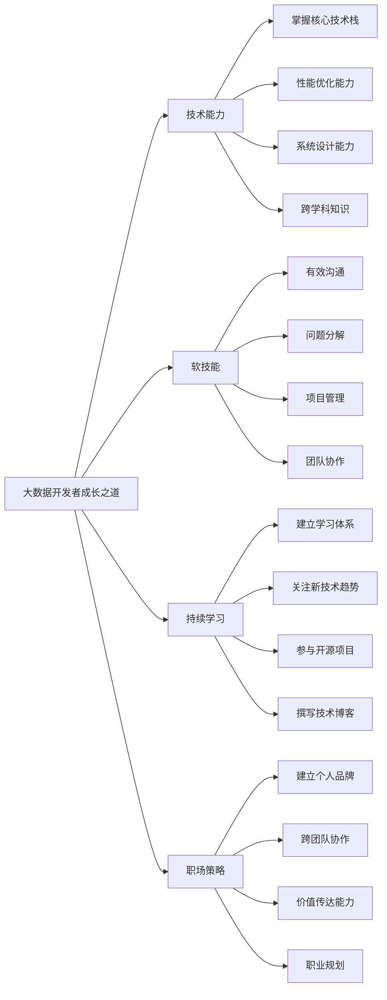

你是否曾经面对一个看似无解的Spark作业性能问题，明明已经优化了数据倾斜、调整了分区策略，但作业执行时间依然像失控的列车一样不断飙升？当你反复检查代码，却始终找不到突破口时，是否曾怀疑自己是否适合继续在大数据领域发展？


如果你有过类似经历，请不要灰心。在这篇文章中，我们将深入探讨大数据开发者常见的技术瓶颈，以及如何从技术和职业发展的角度突破这些障碍，在竞争激烈的大数据行业中持续成长。

## 剖析问题：技术瓶颈背后的多重因素

要解决大数据开发中的性能优化难题，我们首先需要认识到，问题的根源往往不仅仅是技术层面的。就像一个复杂的分布式系统一样，我们的职业发展也是由多个相互关联的"组件"构成的。让我们用大数据处理的思路来分析这个问题：


1. **数据收集（问题识别）**：
   首先，我们需要全面收集"数据"，即详细了解问题的各个方面。这不仅包括技术细节，还包括项目背景、团队协作情况等。

2. **数据清洗（去除干扰因素）**：
   接下来，我们需要剔除无关的干扰因素，专注于真正影响性能的关键点。这个过程类似于数据预处理，目的是提高后续分析的效率和准确性。

3. **特征工程（识别关键因素）**：
   就像在机器学习中提取关键特征一样，我们需要识别出影响问题解决的核心因素。这可能包括技术难点、知识盲区、沟通障碍等。

4. **模型训练（制定解决方案）**：
   基于识别出的关键因素，我们需要"训练"自己的解决问题能力，这包括技术学习、软技能提升等多个方面。

5. **模型评估与优化（反馈与改进）**：
   最后，我们需要不断评估解决方案的效果，并基于反馈进行持续优化，就像调优一个机器学习模型一样。

通过这种系统化的分析方法，我们可以更全面地理解和解决大数据开发中的技术瓶颈问题。

## 技术深度：解决Spark性能优化难题

让我们以一个具体的Spark性能优化问题为例，来展示如何应用上述分析方法：

假设我们有一个大规模的Spark ETL作业，处理数TB级别的日志数据。despite在经过多次优化后，作业执行时间仍然远远超出预期。我们可以按照以下步骤来分析和解决这个问题：

1. **数据收集**：
   - 详细记录作业的执行时间、资源利用情况
   - 分析Spark UI中的stage和task执行情况
   - 检查数据源的特征，如数据量、分布情况等
   - 了解业务需求和时间窗口限制


2. **数据清洗**：
   - 排除网络波动、集群负载等外部因素的影响
   - 确认问题是否只在特定数据集或时间段出现


3. **特征工程**：
   - 识别出可能的性能瓶颈，如数据倾斜、过度shuffle、内存溢出等
   - 分析代码中可能存在的非最优实现

4. **模型训练（解决方案）**：
   基于分析结果，我们可以尝试以下优化策略：


   a. 解决数据倾斜：
   ```scala
   // 使用salting technique来重新分区倾斜的数据
   val saltedData = skewedData.mapPartitions(iter => {
     iter.map(x => (Random.nextInt(100) + "_" + x._1, x._2))
   })
   ```

   b. 优化shuffle操作：
   ```scala
   // 使用reduceByKey替代groupByKey
   val optimizedResult = data.reduceByKey(_ + _)
     .instead of
   val result = data.groupByKey().mapValues(_.sum)
   ```

   c. 调整并行度：
   ```scala
   // 动态设置分区数
   val optimalPartitions = Math.max(200, data.count() / 100000)
   val repartitionedData = data.repartition(optimalPartitions)
   ```

   d. 使用广播变量减少数据传输：
   ```scala
   val broadcastVar = sc.broadcast(largeVariable)
   val result = data.map(row => processwith(row, broadcastVar.value))
   ```

5. **模型评估与优化**：


   - 使用Spark性能分析工具如Flame Graph来可视化性能瓶颈
   - 进行A/B测试，比较优化前后的性能差异
   - 持续监控生产环境中的作业性能，并根据实际情况进行调整

通过这种系统化的方法，我们不仅能够解决具体的技术问题，还能培养一种结构化的思维方式，这在大数据开发中是非常宝贵的。

## 职场智慧：突破技术瓶颈的软技能

然而，仅仅掌握技术知识是不够的。要在大数据开发领域取得长足进步，我们还需要培养一系列关键的软技能。让我们继续用大数据的概念来探讨这些软技能：

1. **数据可视化能力 ≈ 沟通表达能力**
   就像我们需要将复杂的数据转化为直观的图表一样，我们也需要能够清晰地向非技术人员解释复杂的技术概念。

   例子：当你需要向项目经理解释为什么某个优化方案需要更多时间和资源时，试着使用类比：
   "想象我们的数据处理过程是一条繁忙的高速公路。目前，我们所有的'车辆'（数据）都挤在一条车道上，造成了严重的拥堵。我们提议的优化方案就像是增加更多的车道和优化交通信号系统，虽然需要一些时间来实施，但最终会大大提高我们的'通行效率'（数据处理速度）。"

2. **数据清洗 ≈ 问题分解能力**
   在数据清洗中，我们需要将杂乱的原始数据转化为结构化的可用信息。同样，面对复杂的技术难题，我们也需要能够将其分解为可管理的小问题。

   练习：下次遇到棘手的问题时，试着画一个思维导图，将大问题分解为多个小问题。针对每个小问题，列出可能的解决方案和所需资源。

3. **数据集成 ≈ 跨团队协作能力**
   就像我们需要整合来自不同源的数据一样，在职场中，我们也需要与不同背景的同事协作。

   建议：主动参与跨部门项目，了解其他团队（如产品、运营）的工作方式和需求。这不仅能拓宽你的视野，还能帮助你在未来的项目中做出更全面的技术决策。

4. **模型调优 ≈ 持续学习能力**
   在机器学习中，我们不断调整模型以提高其性能。同样，我们也需要不断学习和调整自己的知识结构和工作方法。

   行动计划：
   - 每周抽出2小时学习一个新的大数据技术或工具
   - 每月阅读一篇关于大数据最新趋势的研究报告
   - 每季度参加一次技术会议或线上课程

5. **数据治理 ≈ 项目管理能力**
   就像我们需要制定数据治理策略以确保数据的质量和一致性，我们也需要有效管理项目进度和资源分配。

   技巧：使用项目管理工具（如JIRA）来跟踪任务进度，定期与团队成员同步，及时识别和解决潜在的阻碍因素。

## 自我评估：你的大数据开发者成长指数

为了帮助你更好地了解自己在技术和软技能方面的优势和不足，我设计了一个简单的自评问卷。请根据自己的实际情况，为每个问题打分（1-5分，1分最低，5分最高）：

1. 我能够独立解决Spark作业中的大多数性能问题 [ ]
2. 我经常关注和学习最新的大数据技术和工具 [ ]
3. 我能够清晰地向非技术人员解释复杂的大数据概念 [ ]
4. 我善于将大型项目分解为可管理的小任务 [ ]
5. 我积极参与跨团队协作，并能有效沟通 [ ]
6. 我能够快速适应新的技术栈或开发环境 [ ]
7. 我定期回顾和总结项目经验，不断改进工作方法 [ ]
8. 我能够准确估算任务所需时间和资源 [ ]
9. 我经常主动分享知识，帮助团队成员解决问题 [ ]
10. 我能够平衡技术的完美性和项目的时间压力 [ ]

评分统计：
- 40-50分：恭喜你，你已经是一个全面发展的大数据开发者！
- 30-39分：你在多个方面表现不错，但仍有提升空间。
- 20-29分：你可能在某些领域表现出色，但需要在其他方面加强。
- 20分以下：不要灰心，每个人都有起点。根据上文的建议，制定你的提升计划！

## 大数据开发者的成长之道：综合策略

基于我们的讨论，以下是一些帮助你在大数据开发领域持续成长的综合策略：

1. **建立技术学习体系**
   像设计一个高效的数据处理pipeline一样，为自己设计一个系统化的学习计划：
   - 入口（Input）：订阅高质量的技术博客、参加在线课程
   - 处理（Process）：动手实践，解决实际问题
   - 输出（Output）：写技术博客、参与开源项目、在团队内分享

2. **培养数据思维**
   在解决问题时，尝试用数据驱动的方法：
   - 收集相关数据（如代码运行时间、资源使用情况）
   - 分析数据以识别问题根源
   - 基于数据制定解决方案
   - 验证方案效果，持续优化

3. **扩展技术广度**
   就像我们需要处理各种类型的数据一样，扩展你的技术栈：
   - 除了核心的Spark、Hadoop等技术，也了解流处理、机器学习等相关领域
   - 学习云计算平台（如AWS、Azure、GCP）的大数据服务
   - 掌握一些前端技术，能够快速构建数据可视化原型

4. **提升软技能**
   将你的软技能提升视为一个持续优化的过程：
   - 沟通能力：参加演讲培训，练习向不同背景的人解释技术概念
   - 项目管理：学习敏捷开发方法，如Scrum
   - 团队协作：主动承担team lead的角色，学习如何激励和指导他人

5. **建立个人品牌**
   就像企业需要建立数据资产一样，构建你的个人技术品牌：
   - 维护一个技术博客，分享你的经验和见解
   - 在GitHub上贡献代码，参与开源项目
   - 在Stack Overflow上回答问题，帮助他人的同时提升自己的声誉

6. **保持技术敏锐度**
   像优化一个实时数据处理系统一样，保持对新技术的敏感：
   - 定期阅读技术论文和行业报告
   - 参加技术会议和研讨会
   - 与其他领域的专家交流，获取跨界灵感

## 编程挑战：实战出真知

为了帮助你将学到的知识付诸实践，我设计了一个小型的编程挑战。这个挑战将综合考验你的技术能力和问题解决能力：


**挑战描述**：
你需要设计并实现一个Spark应用，用于分析一个大型的社交网络数据集。数据集包含用户之间的关系（好友）信息，以及用户的行为日志（如发帖、点赞等）。要求如下：

1. 使用Spark SQL 或 DataFrame API实现以下分析：
   - 找出网络中的影响力最大的前10名用户（基于好友数量和互动频率）
   - 检测潜在的机器人账户（基于异常的活动模式）
   - 生成用户活跃度的每小时统计报告

2. 优化你的Spark作业以处理TB级别的数据
   - 考虑数据倾斜、内存使用和shuffle操作等性能因素
   - 实现适当的错误处理和日志记录机制

3. 设计一个简单的REST API，允许其他服务查询分析结果
   - 使用Spark Streaming来保持分析结果的实时性

4. 编写单元测试和集成测试，确保代码的可靠性

5. 准备一个简短的技术文档，解释你的设计决策和优化策略

这里是一个基础的代码框架，你可以在此基础上开始你的实现：

```scala
import org.apache.spark.sql.SparkSession
import org.apache.spark.sql.functions._

object SocialNetworkAnalyzer {
  def main(args: Array[String]): Unit = {
    val spark = SparkSession.builder()
      .appName("Social Network Analyzer")
      .getOrCreate()

    import spark.implicits._

    // 读取用户关系数据
    val relationships = spark.read.parquet("/path/to/relationships")

    // 读取用户行为日志
    val userActivities = spark.read.parquet("/path/to/user_activities")

    // TODO: 实现影响力用户分析
    def findInfluentialUsers(): Unit = {
      // 实现你的代码
    }

    // TODO: 实现机器人检测
    def detectBotAccounts(): Unit = {
      // 实现你的代码
    }

    // TODO: 实现用户活跃度统计
    def generateHourlyActivityReport(): Unit = {
      // 实现你的代码
    }

    // 调用分析函数
    findInfluentialUsers()
    detectBotAccounts()
    generateHourlyActivityReport()

    spark.stop()
  }
}
```

这个挑战不仅测试你的Spark编程能力，还考验你的系统设计、性能优化和API设计能力。在实现过程中，你可能会遇到许多在实际工作中常见的问题，如数据质量问题、性能瓶颈等。这将是一个很好的机会来应用我们之前讨论的问题解决策略。

## 引用业内权威：站在巨人的肩膀上


在探讨大数据开发者的成长之道时，我们不能忽视业内权威的洞见。让我们来看看一些知名专家和最新的行业报告对此有何见解：

1. **Doug Cutting，Hadoop的创始人**，在一次采访中强调：
   "大数据领域的快速发展意味着持续学习是至关重要的。但更重要的是培养解决问题的能力。技术工具会变，但问题解决的核心思维方式是恒定的。"

   这印证了我们之前讨论的重要性，即不仅要专注于学习特定的技术，更要培养系统化的问题解决能力。

2. **Matei Zaharia，Spark的创造者**，在最新一期的《Communications of the ACM》中写道：
   "未来的大数据工程师需要具备更强的跨学科能力。机器学习、统计学，甚至领域知识（如金融、医疗）都将成为差异化的关键因素。"

   这提醒我们，扩展知识广度，特别是跨领域的知识，将成为大数据开发者的重要优势。

3. **Gartner的2023年数据与分析趋势报告**指出：
   "到2025年，80%的数据科学项目将在构建数据管道和数据管理上投入更多时间，而不是在实际的数据科学任务上。这凸显了技术敏锐度和持续学习在快速变化的大数据生态系统中的重要性。"

   这个预测强调了我们不仅要关注核心的数据处理和分析技能，还要在数据工程和数据管理方面不断提升。

4. **Databricks的2024技能趋势报告**显示：
   "软技能，尤其是有效的沟通能力和项目管理技能，正成为大数据开发者最受重视的能力之一。技术专家需要能够将复杂的技术概念转化为业务价值。"

   这再次确认了我们之前强调的软技能的重要性，特别是在跨职能团队协作和向非技术利益相关者传达技术理念方面。

5. **Jeff Dean，Google AI负责人**，在一次技术会议上表示：
   "大规模数据处理的未来在于更智能的系统，这些系统能够自适应地优化性能，而不是仅依赖人工调优。因此，理解和应用机器学习技术来优化大数据系统将成为一个重要趋势。"

   这个观点提醒我们，要密切关注机器学习在大数据系统优化中的应用，这可能成为未来的一个重要技能方向。

这些洞见不仅验证了我们前面讨论的许多观点，还为我们指明了未来的发展方向。作为大数据开发者，我们需要在技术深度、知识广度、软技能和持续学习能力等多个维度上不断进化，才能在这个快速发展的领域中保持竞争力。

## 关键要点总结

让我们用一个简洁的思维导图来总结本文的关键点，帮助你在大数据开发职场中持续成长：



1. **技术能力**:
   - 深入掌握Spark、Hadoop等核心技术栈
   - 培养系统化的性能优化思维
   - 提升大规模系统设计能力
   - 扩展机器学习、统计学等跨学科知识

2. **软技能**:
   - 提高技术概念的表达和沟通能力
   - 培养将复杂问题分解为可管理任务的能力
   - 掌握基本的项目管理技能
   - 增强跨职能团队协作能力

3. **持续学习**:
   - 建立系统化的学习计划和知识管理体系
   - 保持对新技术和行业趋势的敏感度
   - 积极参与开源项目，扩大技术视野
   - 通过写作和分享来深化对技术的理解

4. **职场策略**:
   - 有意识地建立个人技术品牌
   - 主动寻求跨部门合作机会
   - 提升将技术价值转化为业务价值的能力
   - 制定长期职业发展规划，定期反思和调整

记住，成长是一个持续的过程。就像优化一个大数据处理系统一样，我们需要不断迭代、测试和改进我们的能力和策略。在这个过程中，保持好奇心和学习的激情至关重要。

## 结语：构建你的大数据职场"数据湖"

在大数据世界中，我们常常讨论"数据湖"的概念——一个集中存储各种原始数据的仓库，可以根据需要进行灵活的处理和分析。让我们用这个比喻来看待你的职业发展：

你的职业生涯就像一个不断丰富的"数据湖"。每一次项目经历、每一个解决的技术难题、每一次跨团队协作，都是往这个"湖"中注入的宝贵"数据"。你的技术能力、软技能、行业洞察等，都是这个"湖"中的不同"数据流"。

关键在于，你不仅要不断"收集数据"（累积经验），还要学会"数据治理"（反思和总结），并能够灵活地"查询和分析"这些数据（应用经验到新的挑战中）。通过这种方式，你将能够在大数据这个快速变化的领域中，始终保持学习的敏捷性和决策的智慧。

记住，在大数据的世界里，最宝贵的"数据"就是你自己的经验和成长。善用这些"数据"，你将能在大数据开发这个充满机遇和挑战的领域中，绘制出一个独特而精彩的职业轨迹。

现在，是时候开始行动了。从今天的一小步开始，逐步构建和优化你的职场"数据湖"。相信有朝一日，你将成为这个领域的佼佼者，为整个大数据生态系统贡献你的智慧和创新。

祝你在大数据开发的职业道路上披荆斩棘，不断突破！