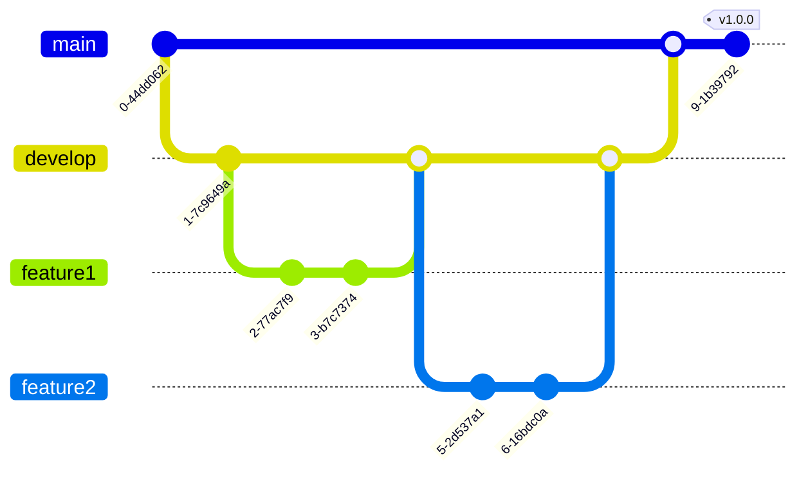

这是一个Git基础知识和常用命令的简要指南,涵盖了日常开发中最常用的操作。你可以将这个指南保存下来,作为日常工作的参考。


学习Git的一些建议:

1. 先理解基本概念,如仓库、分支、提交等。
2. 从基本的工作流程开始练习:修改文件、暂存、提交、推送。
3. 尝试创建和管理分支,这是Git的强大特性之一。
4. 学会查看和理解项目历史,使用`git log`和`git diff`。
5. 熟悉如何处理冲突,这在团队协作中很重要。
6. 多加练习,可以创建一个测试仓库来尝试各种命令。

# 基础篇

## 1. Git基本概念


- 仓库(Repository): 用来存放项目代码的地方
- 分支(Branch): 独立的开发线
- 提交(Commit): 保存当前工作进度
- 远程仓库(Remote): 托管在网络上的项目仓库

## 2. 配置Git


```
git config --global user.name "Your Name"
git config --global user.email "your_email@example.com"
```

## 3. 创建仓库

```
git init  # 在当前目录初始化一个新的Git仓库
git clone <url>  # 克隆一个远程仓库到本地
```

## 4. 基本的工作流程


```
git status  # 查看仓库状态
git add <file>  # 将文件添加到暂存区
git commit -m "commit message"  # 提交更改
git push origin <branch>  # 将本地更改推送到远程仓库
git pull  # 从远程仓库拉取更新
```

## 5. 分支操作


```
git branch  # 列出所有本地分支
git branch <branch-name>  # 创建新分支
git checkout <branch-name>  # 切换到指定分支
git merge <branch-name>  # 合并指定分支到当前分支
```

## 6. 查看历史


```
git log  # 查看提交历史
git diff  # 查看未暂存的更改
```

## 7. 撤销更改

```
git checkout -- <file>  # 撤销对文件的修改
git reset HEAD <file>  # 取消暂存文件
git revert <commit>  # 撤销某次提交
```

## 8. 远程仓库操作


```
git remote add origin <url>  # 添加远程仓库
git fetch  # 从远程仓库获取最新更改但不合并
git pull  # 拉取远程更改并合并到当前分支
git push origin <branch>  # 推送本地分支到远程仓库
```

记住,实践是学习Git的最好方法。尝试在一个测试仓库中使用这些命令,会帮助你更好地理解Git的工作原理。


# Git进阶知识与技巧指南

- 分支管理策略：了解并在实际项目中尝试使用Git Flow或GitHub Flow。
- 练习高级分支操作：尝试使用rebase和cherry-pick，理解它们与merge的区别。
- 熟悉撤销操作：理解reset和revert的不同，谨慎使用，特别是在共享分支上。
- 利用stash功能：在需要快速切换任务时，stash非常有用。
- 了解子模块：如果你的项目依赖其他Git仓库，子模块会很有帮助。
- 使用标签：为重要的版本打标签，便于快速定位。
- 设置别名：为常用命令设置别名，提高效率。
- 探索Git Hooks：尝试使用pre-commit hook来自动运行代码检查。
- 考虑使用Git LFS：如果项目中有大文件，Git LFS可以帮助管理。
- 学会高效查看日志：使用不同的log选项来更好地理解项目历史。
这些高级特性需要在实际项目中反复练习才能熟练掌握。
你可以创建一个练习项目，逐个尝试这些功能。

## 1. 分支管理策略

### Git Flow
一种常用的分支管理策略,包括以下分支:
- master: 主分支,存放稳定版本
- develop: 开发分支
- feature: 功能分支
- release: 发布分支
- hotfix: 热修复分支


这个图表展示了一个基于 Git Flow 的简化工作流。主要特点包括：

- 主分支（main）：只包含稳定的、可发布的代码。
- 开发分支（develop）：日常开发的集成分支。
- 特性分支（feature）：用于开发新功能。
- 发布分支（未显示）：用于准备新的生产版本。
- 热修复分支（未显示）：用于快速修复生产问题。

### GitHub Flow
一种更简单的工作流:
- 只有一个长期分支master
- 其他都是短期的功能分支

## 2. 高级分支操作

```
git rebase <branch>  # 变基操作,将当前分支移植到指定分支之上
git cherry-pick <commit>  # 将指定的提交应用到当前分支
```

## 3. 撤销操作

```
git reset --hard <commit>  # 将HEAD重置到指定提交
git revert <commit>  # 创建一个新的提交来撤销指定提交的更改
```

## 4. 储藏(Stash)

```
git stash  # 暂时储藏当前工作目录的更改
git stash list  # 查看所有储藏
git stash apply  # 应用最近的储藏
git stash drop  # 删除最近的储藏
```

## 5. 子模块(Submodule)

```
git submodule add <url>  # 添加子模块
git submodule init  # 初始化子模块
git submodule update  # 更新子模块
```

## 6. 打标签

```
git tag <tagname>  # 创建轻量标签
git tag -a <tagname> -m "message"  # 创建附注标签
git push origin <tagname>  # 推送标签到远程
```

## 7. 使用别名

在 `.gitconfig` 文件中设置别名可以简化常用命令:

```
[alias]
    co = checkout
    br = branch
    ci = commit
    st = status
```

## 8. 使用 Git Hooks

Git hooks 是在 Git 执行特定事件时自动运行的脚本,位于 `.git/hooks` 目录下。常用的 hooks 包括:

- pre-commit: 提交前运行
- post-commit: 提交后运行
- pre-push: 推送前运行

## 9. 使用 Git Large File Storage (LFS)

对于大文件的版本控制,可以使用 Git LFS:

```
git lfs install  # 安装 Git LFS
git lfs track "*.psd"  # 追踪所有 PSD 文件
```

## 10. 高级日志查看

```
git log --graph --oneline --all  # 查看分支图
git reflog  # 查看所有操作历史
```

这些进阶技巧可以帮助你更高效地使用Git,特别是在复杂的项目或团队协作中。随着实践,你会逐渐掌握这些技巧,并在日常工作中灵活运用。


# 总结

Git 是一个非常强大的版本控制系统,虽然短时间无法全面掌握,但我们可以学习基础知识和常用命令。以下是一个简单的学习大纲:

1. Git 基础概念 (1小时)
   - 什么是版本控制
   - Git 的历史和优势
   - 仓库、提交、分支的概念

2. 安装和配置 Git (30分钟)
   - 在你的操作系统上安装 Git
   - 配置用户名和邮箱

3. 创建和克隆仓库 (1小时)
   - 使用 `git init` 创建新仓库
   - 使用 `git clone` 克隆现有仓库

4. 基本的 Git 工作流程 (2小时)
   - 使用 `git status` 查看仓库状态
   - 使用 `git add` 暂存更改
   - 使用 `git commit` 提交更改
   - 使用 `git log` 查看提交历史

5. 分支操作 (2小时)
   - 创建分支 `git branch`
   - 切换分支 `git checkout`
   - 合并分支 `git merge`

6. 远程仓库操作 (2小时)
   - 添加远程仓库 `git remote add`
   - 推送到远程 `git push`
   - 从远程拉取 `git pull`

7. 实践项目 (剩余时间)
   - 创建一个小项目，运用学到的 Git 命令
   - 模拟团队协作，创建分支、合并更改等

8. 额外资源和回顾 (30分钟)
   - 回顾学习内容
   - 推荐进阶学习资源

这个计划涵盖了 Git 的基础知识。

如果你想要更详细的解释或者关于某个特定部分的更多信息，请随时告诉我。欢迎在评论区交流～